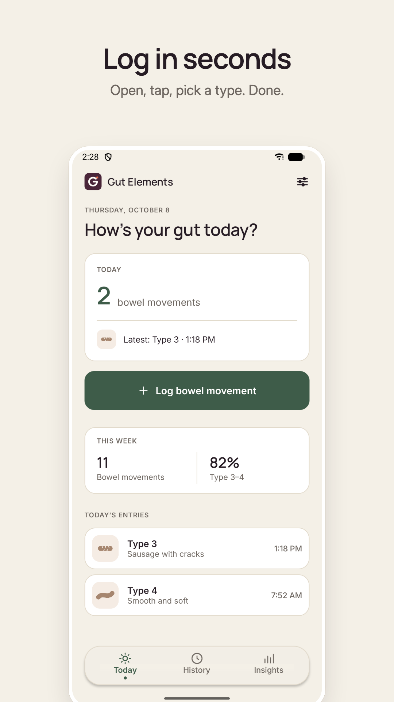
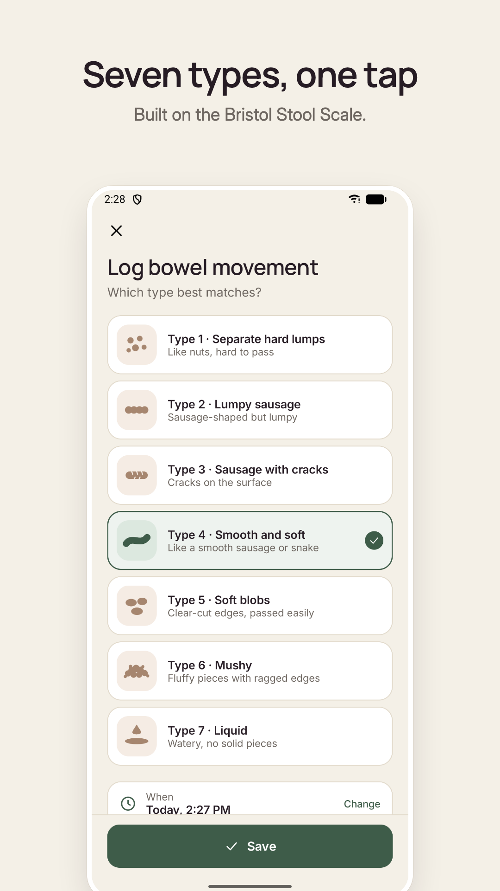
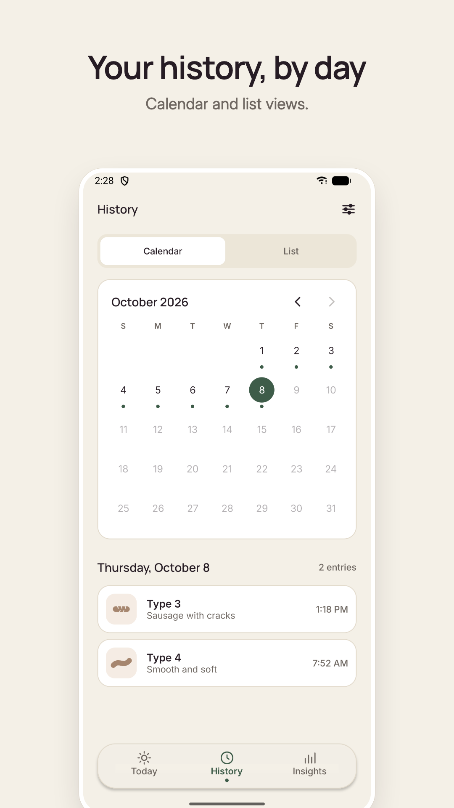
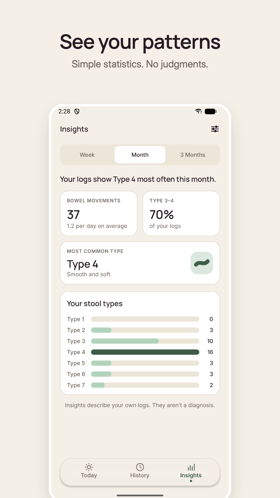
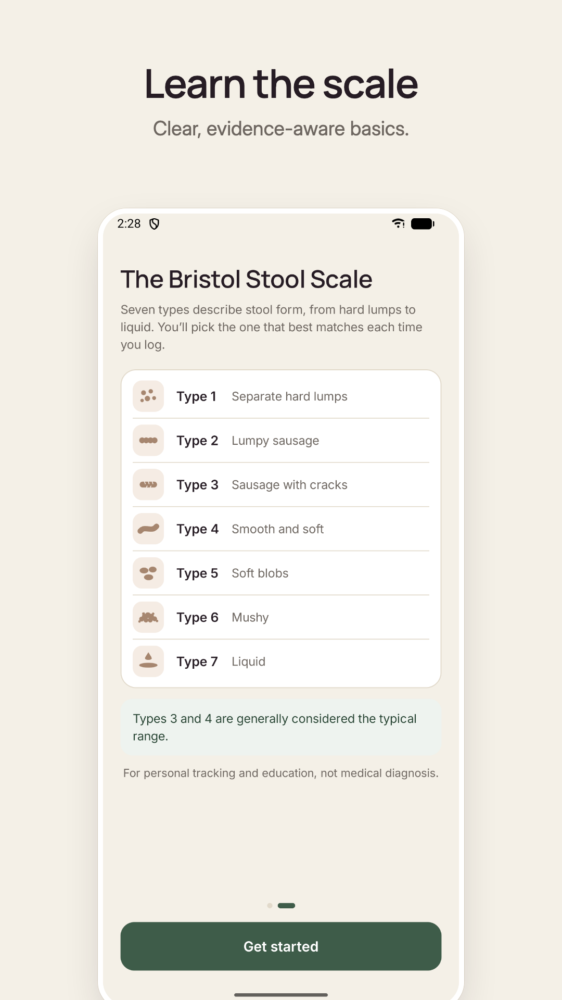

# Gut Elements — an Android app built with Claude Code

A complete, Play Store-ready Android app built end to end with [Claude Code](https://claude.com/claude-code), from product brief to Google Play release. It accompanies a YouTube tutorial (video link coming soon).

<p align="center">
  
  
  
  
  
</p>

## What the app does
Gut Elements is a private bowel-movement tracker built around the Bristol Stool Scale:
- **Log** in a few seconds: pick Type 1–7 and save. Date and time fill in automatically.
- **Today**: today's count, the latest entry and a small weekly summary.
- **History**: calendar and list views; tap any entry to edit or delete it.
- **Insights**: week / month / 3-month totals, Type 3–4 share, most common type and a distribution chart.
- **Private by design**: no account, data stored only on the device, no internet permission.

## How it was built
1. **Product briefs** defined a deliberately small MVP scope.
2. **Google Stitch** produced the visual direction: mockups and a design system ([`docs/design/stitch/`](docs/design/stitch/)).
3. **Claude Code** read both, wrote the app, ran it on an emulator and a real phone, and fixed what it saw.
4. **Release prep**: signing, R8 release build, store listing, graphics, privacy policy and Play Console setup ([`docs/release/`](docs/release/)).

[`docs/design/README.md`](docs/design/README.md) lists where the app deliberately departs from the Stitch mockups.

## Tech stack
- Kotlin, Jetpack Compose (Material 3), Navigation Compose
- Room (SQLite) for entries, DataStore for preferences
- No backend, no network, no third-party SDKs
- minSdk 26 (Android 8.0), target/compileSdk 36

## Run it
Requirements: JDK 17+ and the Android SDK (platform 36). Android Studio works, or the command line.

```bash
./gradlew :app:installDebug      # install on a connected phone or running emulator
./gradlew :app:testDebugUnitTest # unit tests
```

If you build from the command line, create `local.properties` with `sdk.dir=/path/to/Android/sdk`. Android Studio does this for you.

To make your own signed release, see [`docs/release/building-and-signing.md`](docs/release/building-and-signing.md).

## Project layout
```
app/src/main/java/com/gutelements/app/
  data/          Room entity, DAO, database, repositories
  domain/        Bristol types and period statistics (pure Kotlin, unit-tested)
  analytics/     Product events (debug-only logging; release builds send nothing)
  ui/theme       Palette, typography, shapes
  ui/components  Cards, segmented control, bottom bar, Bristol illustrations, icons
  ui/…           onboarding, today, log, history, insights, settings, edit
store/           Play listing text, icon, feature graphic, screenshots
docs/            Design references and release guides
scripts/         Upload-key helper
```

## License
The source code is released under the [MIT License](LICENSE). The **Gut Elements name and logo are not covered**: they're trademarks of their owner and may not be used to publish your own app. If you build on this code, use your own name, icon and package name.

## Disclaimer
Gut Elements is for personal tracking and education. It is not a medical device and does not provide diagnosis or treatment.
